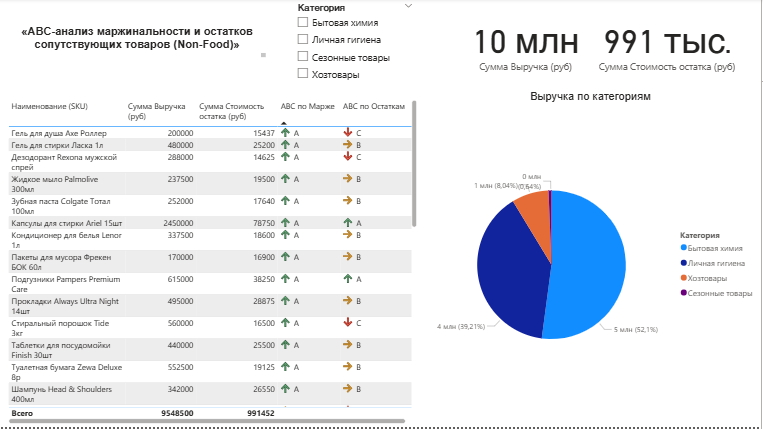

# АВС-анализ маржинальности и остатков сопутствующих товаров (Non-Food)

## 🎯 Описание проекта
Бизнес-кейс по оптимизации ассортиментной матрицы розничной сети. В проекте реализован совмещенный (двухфакторный) **АВС-анализ по марже** (вкладу в прибыль) и **по стоимости остатков на складе** (замороженному капиталу) для 35 SKU. 

Инструмент автоматически подсвечивает неэффективные товары группы C-A (низкая маржинальность при избыточных складских запасах) для их последующей оптимизации.

## 🛠️ Стек технологий
* Power BI Desktop, DAX-меры, Excel.

## 📁 Состав папки
* [Скачать файл дашборда (.pbix)](./АВС-анализ.pbix) — исходная модель и меры.

## 🖼️ Интерактивный интерфейс отчета

