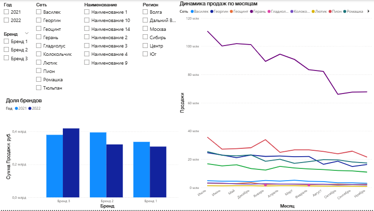

# Аналитический дашборд продаж и коммерческих показателей ритейла

## 🎯 Описание проекта
Инструмент разработан для анализа эффективности ассортиментной матрицы торговых сетей, оценки долей брендов в структуре выручки и анализа эластичности спроса от цены продукции.

## 🛠️ Стек технологий
* Power BI Desktop, DAX, Excel.

## 📁 Состав папки
* [Скачать исходный файл дашборда (.pbix)](./Коммерческий_анализ_сетей.pbix) — для проверки модели данных и DAX-мер.

## 🖼️ Интерактивный интерфейс отчета

